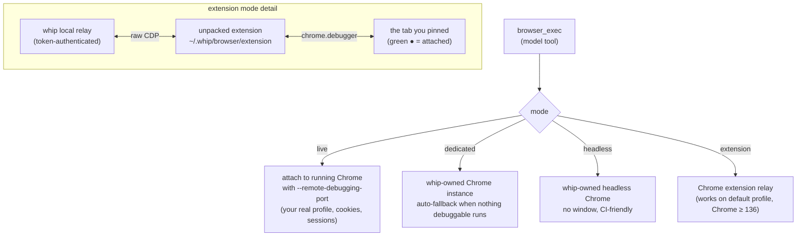
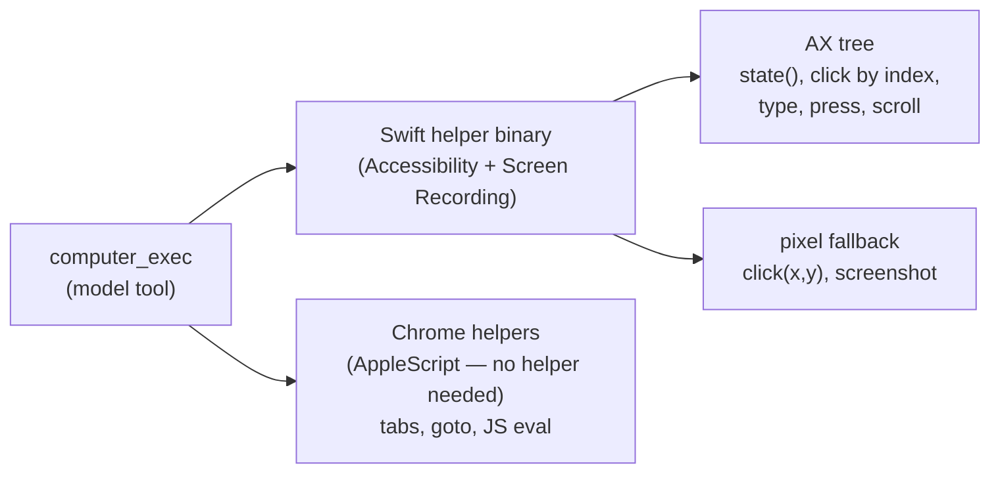

# Browser & computer use

whip drives the user's **real** environment — the Chrome with your cookies
and logins, the Mac desktop with your apps — rather than a sandboxed
playwright instance. Two tools: `browser_exec` (web) and `computer_exec`
(macOS desktop).

## Browser: four modes

`browser.mode` in `~/.whip/config.json` picks how whip talks to Chrome:

- **live** — whip scans well-known Chromium profile dirs for
  `DevToolsActivePort` and attaches. Zero setup if you launch Chrome with
  debugging on.
- **dedicated / headless** — whip launches its own Chrome; the automatic
  fallback when no debuggable Chrome is running.
- **extension** — the only mode that works on Chrome ≥ 136's **default
  profile**, where direct CDP is blocked. Chrome forbids programmatic
  extension install, so setup is `whip browser install` plus three clicks
  (Developer mode → Load unpacked → select the folder). Then click the
  extension icon on a tab to pin it; click again to detach. While pinned,
  Chrome shows a "whip is debugging this browser" bar — that bar *is* the
  mechanism.

## Computer use (macOS)

`computer_exec` drives the actual desktop: accessibility tree first, pixels
as fallback.

- **AX-first**: `state(app)` returns the app's indexed accessibility tree plus
  a screenshot; `click(app, index)` acts on elements, not coordinates.
  Element indexes are generation-guarded — if the UI changed since the read,
  the action fails instead of clicking the wrong thing.
- **Consent-gated**: the first drive of an app asks the user to approve.
  whip never guesses credentials and stops at login walls.
- **Chrome AppleScript path**: driving the user's open Chrome (tabs,
  navigation, `chrome_js`) works through Chrome's AppleScript dictionary with
  no helper at all — the flagship zero-setup path.

On macOS arm64 builds the Swift helper is embedded at build time via
`task driver`.

## Safety posture

Both tools act on the user's behalf with the user's sessions:

- browser relay requires a minted token; extension attach is explicit
  (user clicks the icon per tab).
- computer-use asks per-app consent and is confined to granted Accessibility
  / Screen Recording permissions.
- Screen content is treated as untrusted evidence, not instructions.

## Read next

- [features.md](features.md#browser-automation) — linked to code and tests
- [learnings/browser-use-integration.md](learnings/browser-use-integration.md) —
  the integration notes behind the design
- README §Browser — the user-facing setup walkthrough
