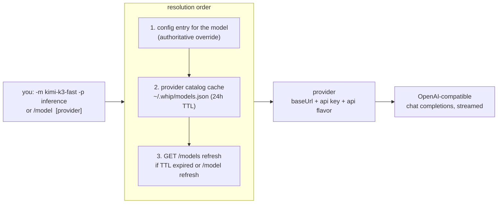
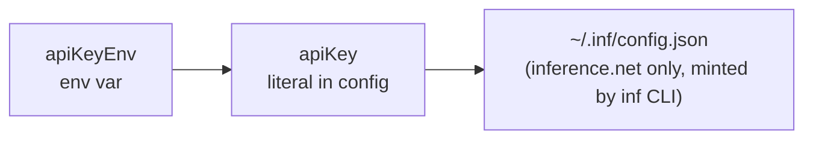

# Models & providers

whip is provider-agnostic by construction: any OpenAI-compatible endpoint is
a provider, models route to providers, and the model catalog is discovered
live — there is no registry to update when a new model ships.

## Routing model

- A model lists the providers that serve it (`"models": {"kimi-k3-fast":
  {"providers": ["inference"]}}`), so switching providers doesn't touch the
  model name.
- **Catalog models need no config entry.** Any model advertised by a
  provider's `GET /models` is usable directly; config entries are overrides
  when present.
- If several providers advertise the same id, pass a provider
  (`-p` / `/model <name> <provider>`) to disambiguate.
- Newly announced models appear in the `/model` picker dimmed, marked
  `(new)`, after `/model refresh` or the next TTL cycle.

## Key resolution

Per provider, in order:

First hit wins. No key material ever lives in the session store.

## Token bookkeeping

Three numbers with distinct meanings:

| Field | Meaning | Drives |
|---|---|---|
| `context` | model's **input** window | header % full, proactive compaction threshold |
| `maxOut` | optional **output** cap | request `max_completion_tokens` |
| provider `context_length` | advertised limit | overrides `context` when present |

The old `maxTokens` field still parses (it always meant the context window)
but is superseded by `context`.

## Cost tracking

When the provider advertises `pricing` in `GET /models`, the status line
shows session spend: `llm.Usage` (prompt/completion/cached) comes off each
streamed response, cached input is billed at the cache-read rate, and totals
accumulate per session. Hidden entirely when pricing isn't advertised.

## Compaction model

Compaction summarizes with a separate, cheaper model:
`compactModel`/`compactProvider` in config, defaulting to
`deepseek-v4-flash-0731` (`config.DefaultCompactModel`), falling back to the
conversation's own model. `/compact <model> [provider]` picks the summarizer
by hand. Mechanics: [agent-loop.md](agent-loop.md#compaction).

## Read next

- [features.md](features.md#models--providers) — linked to code and tests
- README §Config — the full `~/.whip/config.json` reference
